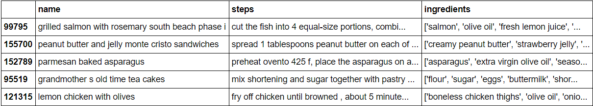
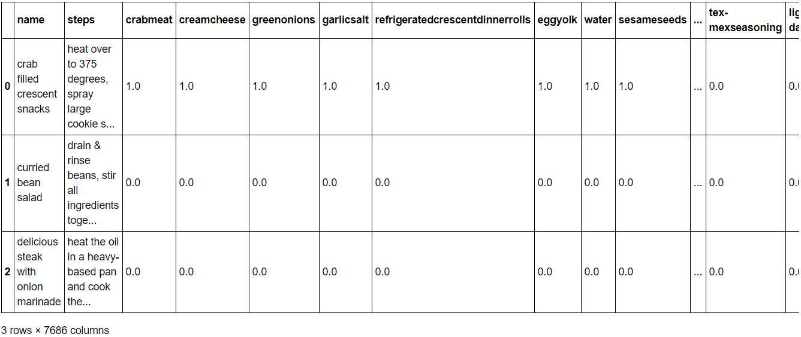

# Cognitive Computing Final Project - GANdon Ramsay 

A project by Jerry Che, Jose Guerrero, Riley Moynihan, Noah Placke, Sarah Teng, & Palmer Wenzel

For our final project this semester, we are creating a recipe GAN that generates recipes consisting of a list of ingredients and a list of instructions to go with those ingredients. As such, we have divided the project into two components: the Ingredients GAN and the Instructions

## Data Preprocessing

### Background
Our data was sourced from the [Food.com Recipes and Interactions](https://www.kaggle.com/shuyangli94/food-com-recipes-and-user-interactions?select=RAW_recipes.csv) because it was the only dataset available that met our criteria for both ingredients and instructions. We wanted ingredients to be specific to a level that there would be overlap between multiple recipes. For example, if a recipe called for macaroni noodles, we wanted the ingredient to be listed as "macaroni noodles" and not something extremely specific like "Kraft-brand Macaroni Elbow Noodles". Our only shortcoming is that there are no measurements for the ingredients, only if it is included in the recipe or not. For instructions, we also wanted something that leaned towards simple because too many unnecessary words could cause trouble when training our model. The Kaggle dataset managed to satisfy our requirements compared to other data sources.

### Processing
Our data started off with many columns we didn't need such as number of steps, number of ingredients, and a description. Our first task was to remove unnecessary columns using

`df_dropped = df_raw.drop(['id', 'minutes', 'contributor_id', 'submitted', 'nutrition', 'n_steps', 'description', 'n_ingredients', 'tags'], axis=1)`

After the extra columns were dropped, we needed to turn the instructions into something more digestible for any future network that will learn from that data column. The text was concatenated from a list where each instruction was its own item into one string of instructions. This was accomplished using

`df_concat['steps'] = df_concat['steps'].apply(lambda x: ''.join([str(i) for i in x if i not in ['[', ']', "'"]]))`

Our data looked like the image below once the initial cleaning was done but we had one more step to do.



In order to get a GAN to train on the ingredients, we couldn't keep them all in the same column. Instead, we wanted each recipe to stay as one row, but each unique ingredient would be in its own column. If the ingredient was present in that recipe, it was marked with a 1, otherwise it was a 0. Because we lacked any measurement data, we had to stick with binary values to indicate presence instead. This meant that our data would become very sparse with multiple thousand columns used to represent each ingredient. This was done using the below code with the final product appearing as the image below.

```
# Do the same character removal as in the previous step, now for ingredients col
df_ings['ingredients'] = df_ings['ingredients'].apply(lambda x: ''.join([str(i).strip() for i in x if i not in ['[', ']', "'"]]))

# Split on commas to make it an actual list now
df_ings['ingredients'] = df_ings['ingredients'].apply(lambda x: x.split(','))

# Create an ingredient column (if doesn't exist) and set the cell value to 1 for each ingredient of each recipe
for index, row in df_ings.iterrows():
    for ingredient in row['ingredients']:
        df_ings.at[index, ingredient] = 1
        
# Repalce NaNs with 0
df_ings = df_ings.fillna(0)

# Drop the original ingredients list
df_ings = df_ings.drop(['ingredients'], axis=1)
```



## Ingredients GAN
