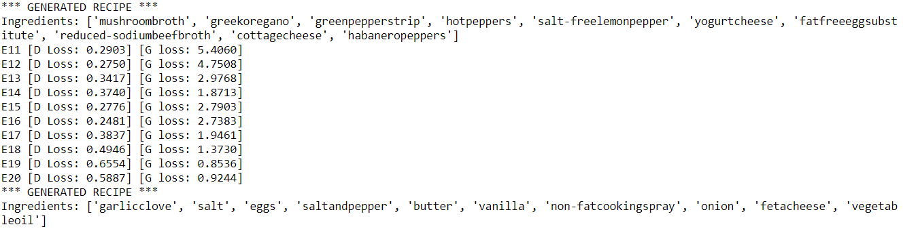
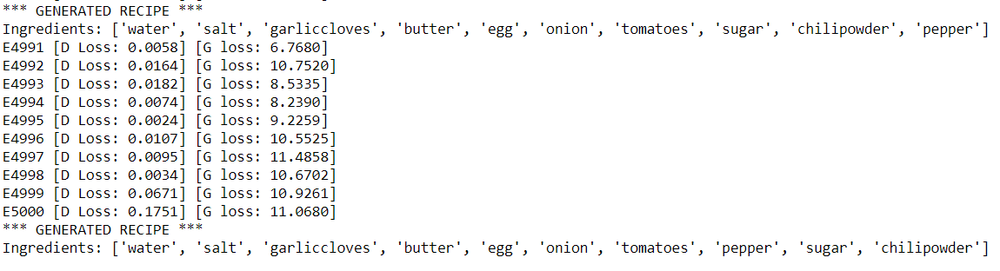

# Cognitive Computing Final Project - GANdon Ramsay 

A project by Jerry Che, Jose Guerrero, Riley Moynihan, Noah Placke, Sarah Teng, & Palmer Wenzel

For our final project this semester, we are creating a recipe GAN that generates recipes consisting of a list of ingredients and a list of instructions to go with those ingredients. As such, we have divided the project into two components: the Ingredients GAN and the Instructions RNN.

## Data Preprocessing

### Background
Our data was sourced from the [Food.com Recipes and Interactions](https://www.kaggle.com/shuyangli94/food-com-recipes-and-user-interactions?select=RAW_recipes.csv) (Kaggle dataset) because it was the only dataset available that met our criteria for both ingredients and instructions. We wanted ingredients to be specific to a level that there would be overlap between multiple recipes. For example, if a recipe called for macaroni noodles, we wanted the ingredient to be listed as "macaroni noodles" and not something extremely specific like "Kraft-brand Macaroni Elbow Noodles". Our only shortcoming is that there are no measurements for the ingredients, only if it is included in the recipe or not. For instructions, we also wanted something that leaned towards simple because too many unnecessary words could cause trouble when training our model. The Kaggle dataset managed to satisfy our requirements compared to other data sources.

### Processing
Our data started off with many columns we didn't need such as number of steps, number of ingredients, and a description. Our first task was to remove unnecessary columns using

```
df_dropped = df_raw.drop(['id', 'minutes', 'contributor_id', 'submitted', 'nutrition', 'n_steps', 'description', 'n_ingredients', 'tags'], axis=1)
```

After the extra columns were dropped, we needed to turn the instructions into something more digestible for any future network that will learn from that data column. The text was concatenated from a list where each instruction was its own item into one string of instructions. This was accomplished using

```
df_concat['steps'] = df_concat['steps'].apply(lambda x: ''.join([str(i) for i in x if i not in ['[', ']', "'"]]))
```

Our data looked like the image below once the initial cleaning was done but we had one more step to do.


In order to get a GAN to train on the ingredients, we couldn't keep them all in the same column. Instead, we wanted each recipe to stay as one row, but each unique ingredient would be in its own column. If the ingredient was present in that recipe, it was marked with a 1, otherwise it was a 0. Because we lacked any measurement data, we had to stick with binary values to indicate presence instead. This meant that our data would become very sparse with multiple thousand columns used to represent each ingredient. This was done using the below code with the final product appearing as the image below.

```
# Do the same character removal as in the previous step, now for ingredients col
df_ings['ingredients'] = df_ings['ingredients'].apply(lambda x: ''.join([str(i).strip() for i in x if i not in ['[', ']', "'"]]))

# Split on commas to make it an actual list now
df_ings['ingredients'] = df_ings['ingredients'].apply(lambda x: x.split(','))

# Create an ingredient column (if doesn't exist) and set the cell value to 1 for each ingredient of each recipe
for index, row in df_ings.iterrows():
    for ingredient in row['ingredients']:
        df_ings.at[index, ingredient] = 1
        
# Repalce NaNs with 0
df_ings = df_ings.fillna(0)

# Drop the original ingredients list
df_ings = df_ings.drop(['ingredients'], axis=1)
```


The data you see above is what we used for our Ingredients GAN, and we were able to use the same preprocessed data (from the previous image) to use in our Instructions RNN model. The only difference between the data we used for Ingredients and Instructions is that the Ingredients data doesn't have any recipe instructions, and the Instructions data doesn't have any ingredient data. We dropped each of these respective columns during data preprocessing. From here, we will go into depth on each component of our Recipes GAN distinguished by ingredients and instructions.

## Ingredients GAN

For this component of the project, we decided to use a GAN, otherwise known as a Generative Adversarial Network. A GAN is a machine learning model in which two neural networks compete with each other to become more accurate in their predictions. To guide our development of the ingredients GAN, we used a couple of resources outlining similar scenarios. Specifically, we used this article called [Generating Tabular Synthetic Data using GANs] (https://www.maskaravivek.com/post/gan-synthetic-data-generation/) which follows a similar example to what we're trying to do, using healthcare data. 

### Build the Model

To build out our GAN, we started by building out each individual part: the Generator, the Descrimintator, and the GAN model which combines the two. 
# NOAH to explain generator/descriminator

```
def build_gan(generator, discriminator):
    # Only train generator in combined model
    discriminator.trainable=False
    
    gan_input = Input(shape=(noise_dim,))
    x = generator(gan_input)
    gan_output = discriminator(x)
    
    # Create the GAN model
    gan = Model(inputs=gan_input, outputs=gan_output)
                      
    gan.compile(loss='binary_crossentropy', optimizer='adam')
    
    return gan
```

### Train the Model

Next, we build out the training loop that would utilize the GAN model and allow it to learn. In each epoch of the loop, the generator spits out a fabricated recipe, and the descriminator determines whether or not it thinks the recipe is real. This is communicated through a loss metric in each epoch— the lower the loss, the better. 

```
def training(X_train, X_test, epochs=1, batch_size=32, sample_interval=10):
    # Get batch count
    batch_count = X_train.shape[0] / batch_size
    
    # Build GAN
    generator = build_generator()
    discriminator = build_discriminator()
    gan = build_gan(generator, discriminator)
    
    # Training step
    for e in range(1, epochs + 1):
        # for _ in tqdm(range(batch_size)):
            
        # Random noise as an input to initialize the generator
        noise = random_noise(batch_size)
        # replace with Laplace?
        # replace high% of noise with 0

        # Use the GAN to generate "fake" recipes
        generated_recipes = generator.predict(noise)

        # Get a sample of real recipes from data
        # real_recipes = X_train.loc[np.random.randint(low=0, high=X_train.shape[0], size=batch_size)]
        real_recipes = X_train.sample(batch_size)

        # Mix the real and fake data
        X = np.concatenate([real_recipes, generated_recipes])

        # Create labels for real and fake data
        y_dis = np.zeros(2 * batch_size)  # fake
        y_dis[:batch_size] = 1.0          # real

        # Train the discriminator while generator is fixed
        discriminator.trainable = True
        d_loss = discriminator.train_on_batch(X, y_dis)

        # Fix the images generated by the generator as real
        noise = random_noise(batch_size)
        y_gen = np.ones(batch_size)

        # Train the generator (to have the discriminator label samples as valid)
        discriminator.trainable = False
        g_loss = gan.train_on_batch(noise, y_gen)

        # Output loss
        print(f"E{e} [D Loss: {d_loss:.4f}] [G loss: {g_loss:.4f}]")
            
        # Display created recipes at a given epoch interval
        if e % sample_interval == 0:
            # Display recipe
            display_recipe(e, generator)
    
    return generator, discriminator, gan
```

We ran our GAN for 5000 epochs, and this is the output that was generated. 

In the beginning of the training loop, the output looked like this:



But as the model continued to learn, the output looked like this:



As you can see, the list of ingredients began to converge into a list of common cooking essentials and became less varied overall, which leads us to believe that mode collapse was taking place. Mode collapse is a common issue among GANs in which the generator starts producing the same output (or a small set of outputs) over and over again because it has learned to fool the descriminator with those successful outputs. Some methods to remedy mode collapse include the Wasserstein loss and the use of unrolled GANs. 

We decided to try and remedy our model using the Wasserstein loss.

### insert success or failure here

## Instructions RNN

For this component of the project, we decided to use an RNN model in the same way that image captioning works. The RNN will take in a list of ingredients (similar to the way an RNN would take in an image input) and output a generated list of instructions to complement the list of ingredients. 

### INGREDIENTS TEAM to write and describe this part of the project
