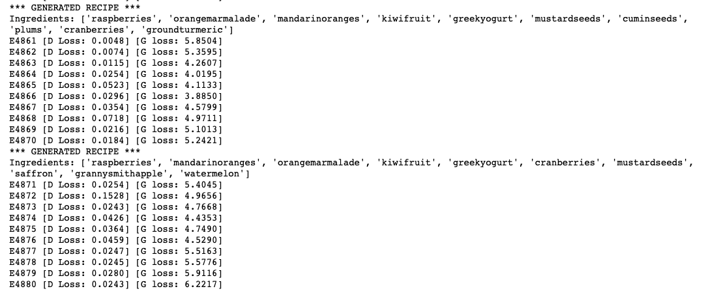
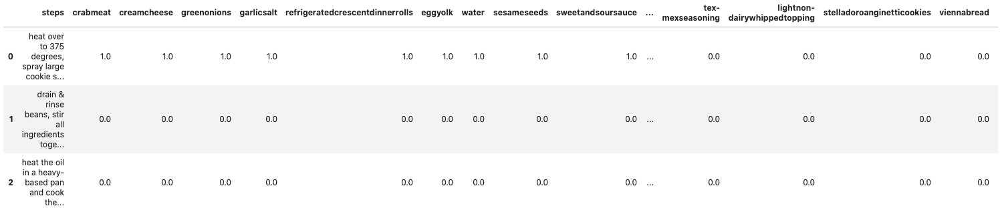
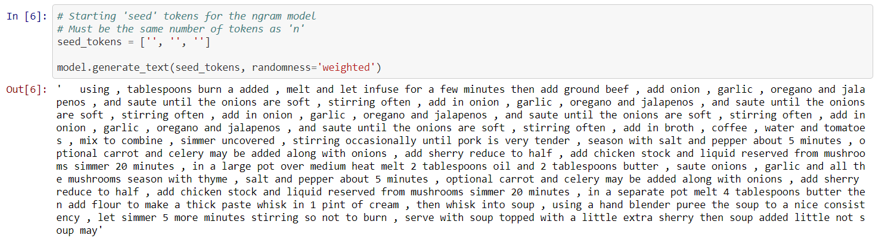
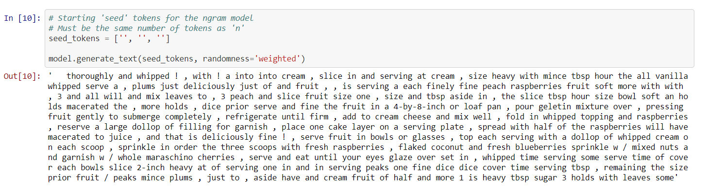

# Cognitive Computing Final Project - GANdon Ramsay 

A project by Jerry Che (jc78222), Jose Guerrero, Riley Moynihan (rcm2944), Noah Placke (ntp352), Sarah Teng (st29653), & Palmer Wenzel (phw295)

For our final project this semester, we are creating a recipe GAN that generates recipes consisting of a list of ingredients and a list of instructions to go with those ingredients. As such, we have divided the project into two components: the Ingredients GAN and the Instructions n-grams.

## Data Preprocessing

### Background
Our data was sourced from the [Food.com Recipes and Interactions](https://www.kaggle.com/shuyangli94/food-com-recipes-and-user-interactions?select=RAW_recipes.csv) (Kaggle dataset) because it was the only dataset available that met our criteria for both ingredients and instructions. We wanted ingredients to be specific to a level that there would be overlap between multiple recipes. For example, if a recipe called for macaroni noodles, we wanted the ingredient to be listed as "macaroni noodles" and not something extremely specific like "Kraft-brand Macaroni Elbow Noodles". Our only shortcoming is that there are no measurements for the ingredients, only if it is included in the recipe or not. For instructions, we also wanted something that leaned towards simple because too many unnecessary words could cause trouble when training our model. The Kaggle dataset managed to satisfy our requirements compared to other data sources.

The Kaggle dataset had about 180K recipes, which we had to reduce down to about 25K in order to run successfully on our machines.

### Processing
Our data started off with many columns we didn't need such as number of steps, number of ingredients, and a description. Our first task was to remove unnecessary columns using

```
df_dropped = df_raw.drop(['id', 'minutes', 'contributor_id', 'submitted', 'nutrition', 'n_steps', 'description', 'n_ingredients', 'tags'], axis=1)
```

After the extra columns were dropped, we needed to turn the instructions into something more digestible for any future network that will learn from that data column. The text was concatenated from a list where each instruction was its own item into one string of instructions. This was accomplished using

```
df_concat['steps'] = df_concat['steps'].apply(lambda x: ''.join([str(i) for i in x if i not in ['[', ']', "'"]]))
```

Our data looked like the image below once the initial cleaning was done but we had one more step to do.


In order to get a GAN to train on the ingredients, we couldn't keep them all in the same column. Instead, we wanted each recipe to stay as one row, but each unique ingredient would be in its own column. If the ingredient was present in that recipe, it was marked with a 1, otherwise it was a 0. Because we lacked any measurement data, we had to stick with binary values to indicate presence instead. This meant that our data would become very sparse with multiple thousand columns used to represent each ingredient. This was done using the below code with the final product appearing as the image below.

```
# Do the same character removal as in the previous step, now for ingredients col
df_ings['ingredients'] = df_ings['ingredients'].apply(lambda x: ''.join([str(i).strip() for i in x if i not in ['[', ']', "'"]]))

# Split on commas to make it an actual list now
df_ings['ingredients'] = df_ings['ingredients'].apply(lambda x: x.split(','))

# Create an ingredient column (if doesn't exist) and set the cell value to 1 for each ingredient of each recipe
for index, row in df_ings.iterrows():
    for ingredient in row['ingredients']:
        df_ings.at[index, ingredient] = 1
        
# Repalce NaNs with 0
df_ings = df_ings.fillna(0)

# Drop the original ingredients list
df_ings = df_ings.drop(['ingredients'], axis=1)
```


The data you see above is what we used for our Ingredients GAN, and we were able to use the same preprocessed data (from the previous image) to use in our Instructions RNN model. The only difference between the data we used for Ingredients and Instructions is that the Ingredients data doesn't have any recipe instructions, and the Instructions data doesn't have any ingredient data. We dropped each of these respective columns during data preprocessing. From here, we will go into depth on each component of our Recipes GAN distinguished by ingredients and instructions.

## Ingredients GAN

For this component of the project, we decided to use a GAN, otherwise known as a Generative Adversarial Network. A GAN is a machine learning model in which two neural networks compete with each other to become more accurate in their predictions. To guide our development of the ingredients GAN, we used a couple of resources outlining similar scenarios. Specifically, we used this article called [Generating Tabular Synthetic Data using GANs] (https://www.maskaravivek.com/post/gan-synthetic-data-generation/) which follows a similar example to what we're trying to do, using healthcare data. 

### Build the Model

To build out our GAN, we started by building out each individual part: the Generator, the Descrimintator, and the GAN model which combines the two.
The generator in our model is the source of our ideal random recipe output. Random noise goes into the generator, and a random recipe is spit out. Our discriminator then comes into play. The discriminator is the driving force of learning in a GAN. Recipes are fed into the discriminator and its job is to identify whether or not the recipe fed in was a real recipe from our actual data, or a fake recipe created by the generator. These two components go back and forth with the generator trying to trick the discriminator and the discriminator trying to catch the generator. As they battle, they learn what to look for in a real recipe more clearly. In a perfect situation, the generator will be so good at producing recipes that they are seen as potential real life recipes. This is our goal when we train the GAN model.

```
def build_gan(generator, discriminator):
    # Only train generator in combined model
    discriminator.trainable=False
    
    gan_input = Input(shape=(noise_dim,))
    x = generator(gan_input)
    gan_output = discriminator(x)
    
    # Create the GAN model
    gan = Model(inputs=gan_input, outputs=gan_output)
                      
    gan.compile(loss='binary_crossentropy', optimizer='adam')
    
    return gan
```

### Train the Model

Next, we build out the training loop that would utilize the GAN model and allow it to learn. In each epoch of the loop, the generator spits out a fabricated recipe, and the descriminator determines whether or not it thinks the recipe is real. This is communicated through a loss metric in each epoch— the lower the loss, the better. 

```
def training(X_train, X_test, epochs=1, batch_size=32, sample_interval=10):
    # Get batch count
    batch_count = X_train.shape[0] / batch_size
    
    # Build GAN
    generator = build_generator()
    discriminator = build_discriminator()
    gan = build_gan(generator, discriminator)
    
    # Training step
    for e in range(1, epochs + 1):
        # for _ in tqdm(range(batch_size)):
            
        # Random noise as an input to initialize the generator
        noise = random_noise(batch_size)
        # replace with Laplace?
        # replace high% of noise with 0

        # Use the GAN to generate "fake" recipes
        generated_recipes = generator.predict(noise)

        # Get a sample of real recipes from data
        # real_recipes = X_train.loc[np.random.randint(low=0, high=X_train.shape[0], size=batch_size)]
        real_recipes = X_train.sample(batch_size)

        # Mix the real and fake data
        X = np.concatenate([real_recipes, generated_recipes])

        # Create labels for real and fake data
        y_dis = np.zeros(2 * batch_size)  # fake
        y_dis[:batch_size] = 1.0          # real

        # Train the discriminator while generator is fixed
        discriminator.trainable = True
        d_loss = discriminator.train_on_batch(X, y_dis)

        # Fix the images generated by the generator as real
        noise = random_noise(batch_size)
        y_gen = np.ones(batch_size)

        # Train the generator (to have the discriminator label samples as valid)
        discriminator.trainable = False
        g_loss = gan.train_on_batch(noise, y_gen)

        # Output loss
        print(f"E{e} [D Loss: {d_loss:.4f}] [G loss: {g_loss:.4f}]")
            
        # Display created recipes at a given epoch interval
        if e % sample_interval == 0:
            # Display recipe
            display_recipe(e, generator)
    
    return generator, discriminator, gan
```

We ran our GAN for 5000 epochs, and this is the output that was generated. 

In the beginning of the training loop, the output looked like this:


But as the model continued to learn, the output looked like this:


As you can see, the list of ingredients began to converge into a list of common cooking essentials and became less varied overall, which leads us to believe that mode collapse was taking place. Mode collapse is a common issue among GANs in which the generator starts producing the same output (or a small set of outputs) over and over again because it has learned to fool the descriminator with those successful outputs. Some methods to remedy mode collapse include the Wasserstein loss and the use of unrolled GANs. 

We decided to try and remedy our model using the Wasserstein loss, which, in the end remained unsuccessful due to an unknown bug, but it helped us be more creative in the end to solve our mode collapse problem.

### Solving Mode Collapse

To solve the mode collapse issue, we had to get a little creative with the data and how we wanted to process it. Since we noticed that the GAN was learning to converge on a list of very common ingredients found across most recipes, we decided to eliminate these ingredients from the mix, and that was generally able to solve our problem. We ended up dropping the ingredient columns with a sum greater than some threshold (we tried both 50 and 75), which means that the ingredient showed up in more than 50 or 75 recipes in the dataset. As such, these dropped columns would turn out to be the ingredients we were seeing the GAN converging on, such as butter, oil, salt, sugar, flour, etc. In this way, we successfully forced the GAN to output a variety of unique combinations, and it did not converge on a single subset each time.



## Instructions N-Grams 

For this component of the project, we originally decided to use an Recurrent Neural Network model in the same way that image captioning works. The RNN would take in a list of ingredients (similar to the way an RNN would take in an image input) and output a generated list of instructions to complement the list of ingredients. 

To do this, we cleaned the data a little more so that we ended up with a separated list of instructions for each recipe, and a separated set of ingredients to go with those instructions. 



From the set of instructions/steps, we created a vocabulary set of unique words, and then created an index to those unique word mappings. From there, we made a word embeddings matrix by combining the word mappings index with pre-trained word vectors (GloVe, in this case). Then we built an RNN model and tried to train it. 

Unfortunately, in building and training our RNN, we encountered a bug we were unable to resolve. We decided to modify our approach to use n-gram probability distributions to generate our instructions.

We used n-grams to look at the text as a whole, and calculate the probabilities of certain word associations. N-grams excel in natural language processing for the purpose of identifying co-occurrent words. Here's an example of our fit method below, where the model learns the n-gram probabilities from the corpus. 

```
def fit(self, corpus, min_df=.1):
        """Train the model on a given corpus"""
        
        for document in corpus:
            # Tokenize text into words
            self.tokens = word_tokenize(document)
            
            self.remove_below_min_df(min_df)
            
            # Create n-grams from tokens
            ngrams = zip(*[self.tokens[i:] for i in range(self.n + 1)])
            
            # Get count of next token after each ngram
            ngram_counts = defaultdict(Counter)
            for ngram in ngrams:
                ngram_counts[ngram[:-1]][ngram[-1]] += 1

            # Normalize counts
            for ngram, counter in ngram_counts.items():
                s = float(sum(counter.values()))
                self.ngram_probas[ngram] = sorted([(c,cnt/s) for c,cnt in counter.items()], key=lambda x: x[1], reverse=True)
                
            self.calc_token_distribution()
```

While our RNN failed to work altogether, our n-gram approach was successful in at least generating some instructions. 



By instead fitting our model on steps whose recipe contains some given ingredient, we were able to get a much more reasonable output. 

```
# Fit the model on the corpus with a common ingredient
# Get steps from recipes with a certain ingredient
ingredient = 'raspberries'
steps_to_fit = df.loc[df[ingredient] == 1.0]['steps']

# Create and fit the model
model = N_Gram(n=3)
model.fit(steps_to_fit.values, min_df=0)
```



## Conclusion

While the instructions we ended up with aren't necessarily coherent in modern english, we can begin to see improvements of the model given a few adjustments. Since we started the project and each model from scratch, we were unable to resolve some of the bigger bugs we encountered. Given the time constraints, we opted for a more traditional approach and decided to lay down the groundwork for other complex models. With more time, we would hope to go more in-depth into a more customized approach, perhaps with stronger ingredient associations or more cohesive instructions. 

On the GAN side of our project, we would've benefitted from having more data to work with and more time to tune the hyperparameters. However, given the constraints we faced, we are satisfied with what we were able to accomplish this semester. 
